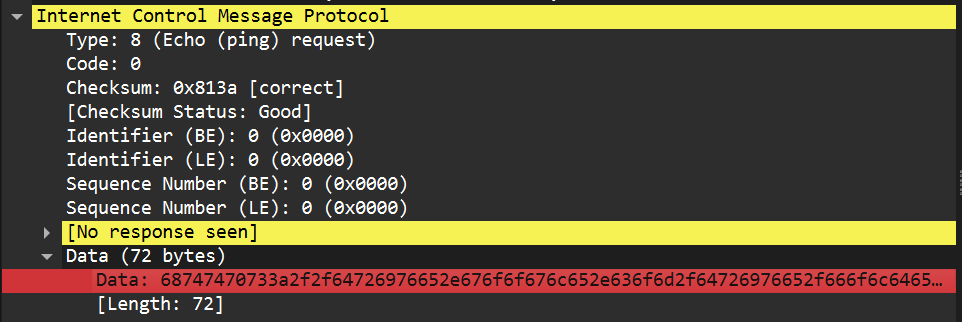

# Challenge Name - Okayhogyaaa
# Author: g0kbur0 
# Writeup written by: Noor Ul Hassan
### Category: Forensics
### Difficulty: Medium

## Approach & Solution
Download the pcap file and open it  

  

Now check the ICMP Header and then data:  

  

Copy this as value and then paste it in dcode.fr (This is an ASCII) and decode it.  

  

As you can see, there is a Google Drive link. Copy this and paste it into your browser. Go to the SUDO FUZZERS folder and analyze it.  

  

Open the ReadmeMUST.txt  

  

This says to combine all of the files, but which files? We will see later. Now, download the DownloadME.zip as it seems suspicious.  
After the download is complete, extract the file.  

  

After extraction, you will see four more .zip files named as part0, part1, and so on. Here, we will use the hint of combining all the files in one folder. Extract all of them and then place them in one folder.  

  

Now, I have combined all of them in a separate folder.  

  

As you can see from the files, this is a Kali VM machine and now we simply need to open it in VMware.  

  

Power on the machine  

  

The machine will ask for a snapshot file to open the VM with the extension .vmsn  

  

Click on browse, select type as **All files**, and choose **"kali-linux-2024.3-vmware-amd64.vmxf"**  

  

Your VM will load and will ask for the username and password. By default, the username and password of the Kali machine are `kali` and `kali`, and this works in this case.  

  

You will now see a lot of folders on the *Desktop* containing false flags:  

  

Now go to the *home* directory and press *CTRL+H*. This will show all the hidden files. Click on the *bash_history* file.  

  

In the bash history file, we found that the folders **flagyahanhe169** and **flagyahanhe239** were visited by the previous user.  

  

Now, when we visit **flagyahanhe239**, we find one encrypted folder and one script to unlock that folder.  

  

Now, when we try to open the script, it says we do not have permission. So open the terminal here and use the following command:  

```bash
sudo chmod +x unlock_folder.sh
# Command used to make the script executable

Now run the following command:

    sudo nano unlock_folder.sh

this will open the script in the editor and now you can see the content of the file:

  

Now from the code we know that the script need a key and key.txt file which contains the key in the same directory as the script. So we wil create the key.txt file


Now the only thing we need is the key. Now where we will find the key?? Now there are two ways one is in the kali system and other is in the google drive form where we downloaded the kali machine. I will go with 1st one but will also tell you about the 2nd one.

Go to the home directory and find the .zsh_history. Analyze the file there you will find the cr7.jpg file and the author using exiftool pushed a comment to that picture. You will find the picture in the drive and use exiftool to find the comment but we can also find it here in the .zsh_history.


Now paste this key in the key.txt file and run the script it will unlock the folder.


Now the folder has unlocked.


Now in the folder in the txt file you will find the flag.


